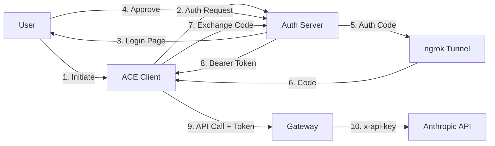

# OAuth Implementation Comparison: ACE vs Automagik Genie

## Executive Summary

This document compares two distinct OAuth implementations for AI/LLM authentication:
- **ACE (Autonomous Coding Engine)**: Uses OAuth 2.0 Authorization Code flow with PKCE for user-delegated access
- **Automagik Genie**: Uses OAuth 2.1 Client Credentials flow for machine-to-machine authentication

Both solve the problem of secure API access but target different use cases and architectures.

## Implementation Comparison Matrix

| Feature | ACE OAuth | Automagik Genie OAuth 2.1 |
|---------|-----------|---------------------------|
| **OAuth Flow** | Authorization Code + PKCE | Client Credentials |
| **OAuth Version** | 2.0 with PKCE extension | 2.1 compliant |
| **Authentication Type** | User-delegated (3-legged) | Machine-to-machine (2-legged) |
| **Token Type** | Opaque Bearer tokens | JWT (RS256 signed) |
| **Token Validation** | Gateway validates with auth server | Self-contained JWT validation |
| **User Interaction** | Browser-based authorization | No user interaction needed |
| **Refresh Mechanism** | Token persistence + expiry check | No refresh (reauth required) |
| **Callback Handling** | ngrok tunnel + localhost server | Not needed (direct exchange) |
| **Primary Use Case** | User authorizes ACE to call Claude | Service-to-service MCP auth |
| **Setup Complexity** | Medium (ngrok + browser flow) | Low (client credentials only) |
| **Security Model** | PKCE prevents code interception | JWT signature validation |

## Architectural Analysis

### ACE: User-Delegated Authorization



**Key Characteristics:**
- **Interactive**: Requires user to approve access in browser
- **Delegated**: ACE acts on behalf of the user
- **Secure**: PKCE prevents authorization code interception
- **Tunneled**: ngrok exposes localhost callback to internet
- **Persistent**: Tokens cached to disk for reuse

**Best For:**
- User-specific API access
- Long-running sessions with user context
- Scenarios requiring user consent
- Personal tooling and CLI applications

### Automagik Genie: Service Authentication

```mermaid
graph LR
    A[MCP Client] -->|1. client_id + secret| B[/oauth/token]
    B -->|2. JWT| A
    A -->|3. MCP Call + JWT| C[Auth Middleware]
    C -->|4. Validate JWT| C
    C -->|5. Execute| D[MCP Tool]
    D -->|6. Response| A
```

**Key Characteristics:**
- **Non-interactive**: Pure machine-to-machine flow
- **Self-contained**: JWT includes all auth information
- **Stateless**: No server-side session needed
- **Direct**: No callback or tunnel required
- **Discoverable**: `.well-known` endpoint for metadata

**Best For:**
- Service-to-service authentication
- MCP server protection
- Multi-client scenarios (Claude + ChatGPT)
- Production deployments

## Implementation Details Comparison

### Token Generation & Storage

**ACE:**
```python
# Token obtained via OAuth flow
token = OAuth2Token(
    access_token="opaque_token_string",
    expires_at=time.time() + 3600,
    refresh_token="refresh_token_if_provided"
)
# Persisted to ~/.config/ace_oauth_token.json
```

**Automagik:**
```javascript
// JWT generated server-side
const token = jwt.sign({
    iss: 'genie-mcp-server',
    aud: 'http://localhost:8885/mcp',
    scope: 'mcp:read mcp:write',
    exp: Math.floor(Date.now() / 1000) + 3600
}, privateKey, { algorithm: 'RS256' });
```

### Authentication Middleware

**ACE (Client-side):**
```python
# OAuth token automatically attached
headers = {
    "Authorization": f"Bearer {token.access_token}",
    "anthropic-version": "2023-06-01"
}
# Gateway translates Bearer → x-api-key
```

**Automagik (Server-side):**
```javascript
// Middleware validates every request
function validateHttpAuth(req, res, next) {
    if (PUBLIC_PATHS.includes(req.path)) return next();

    const token = extractBearerToken(req.headers.authorization);
    try {
        jwt.verify(token, publicKey, {
            algorithms: ['RS256'],
            issuer: 'genie-mcp-server',
            audience: 'http://localhost:8885/mcp'
        });
        next();
    } catch (err) {
        res.status(401).json({ error: 'Unauthorized' });
    }
}
```

### Configuration Management

**ACE:**
```bash
# Environment variables
export ACE_OAUTH_AUTH_URL="https://gateway.com/oauth/authorize"
export ACE_OAUTH_TOKEN_URL="https://gateway.com/oauth/token"
export ACE_OAUTH_CLIENT_ID="ace-client"
export ACE_OAUTH_SCOPE="anthropic:messages:write"
export NGROK_AUTHTOKEN="ngrok_token"
```

**Automagik:**
```javascript
// Setup wizard generates credentials
{
    "oauth": {
        "clientId": "generated-uuid",
        "clientSecret": "secure-random-secret",
        "tokenEndpoint": "http://localhost:8885/oauth/token"
    }
}
```

## Security Considerations

### ACE Security Model

**Strengths:**
- PKCE prevents authorization code interception attacks
- State parameter prevents CSRF
- Token never exposed to browser
- User explicitly consents to access

**Considerations:**
- ngrok tunnel is attack surface
- Token file permissions critical (600)
- Gateway must securely map tokens to API keys

### Automagik Security Model

**Strengths:**
- JWT signature prevents tampering
- Self-contained validation (no auth server round-trip)
- Scoped access control
- Public key can be distributed for validation

**Considerations:**
- Client secrets must be protected
- No token revocation without blacklist
- JWT size overhead in every request
- Clock skew can cause validation issues

## Integration Patterns

### When to Use ACE Pattern

1. **User-Authorized Tools**: CLI tools that need user's API access
2. **Personal Assistants**: Bots acting on user's behalf
3. **Development Tools**: IDE plugins with user-specific context
4. **Delegated Access**: When tool shouldn't have its own credentials

### When to Use Automagik Pattern

1. **MCP Servers**: Protecting Model Context Protocol endpoints
2. **Service Mesh**: Microservice authentication
3. **Multi-Client**: Same server, multiple AI clients (Claude, ChatGPT)
4. **Stateless APIs**: When server shouldn't maintain sessions

## Lessons Learned & Best Practices

### From ACE Implementation

1. **Lazy Initialization**: Create OAuth client only when needed
2. **Token Caching**: Persist tokens to avoid repeated auth flows
3. **Graceful Fallbacks**: Template-based fallbacks when OAuth unavailable
4. **Retry Logic**: Handle transient failures with exponential backoff

### From Automagik Implementation

1. **Metadata Endpoints**: `.well-known` for OAuth discovery
2. **Public Path Bypass**: Health checks shouldn't require auth
3. **Unified Startup**: Single command for all services
4. **Setup Wizard**: Guide users through credential configuration

## Hybrid Approach Possibilities

A unified system could combine both approaches:

```yaml
auth_modes:
  user_delegated:
    # ACE-style for user actions
    flow: authorization_code_pkce
    use_cases: ["cli_tools", "user_automation"]

  service_to_service:
    # Automagik-style for services
    flow: client_credentials
    use_cases: ["mcp_server", "api_gateway"]

  hybrid:
    # Initial user auth, then service tokens
    flow: authorization_code → client_credentials
    use_cases: ["long_running_agents", "batch_processing"]
```

## Migration Considerations

### From Bearer Tokens to OAuth

Both projects migrated from simple bearer tokens:

**ACE Migration Path:**
1. Keep CLI interface unchanged
2. Add OAuth client behind the scenes
3. Fall back to templates if OAuth fails
4. Gradual rollout with environment flags

**Automagik Migration Path:**
1. Remove legacy bearer token support
2. Add setup wizard for credentials
3. Update all clients simultaneously
4. Breaking change with clear upgrade path

## Recommendations

### For ACE-style Projects

1. **Consider JWT**: Could reduce gateway complexity
2. **Add Metadata**: `.well-known` endpoint for discovery
3. **Implement Refresh**: Use refresh tokens to reduce re-auth
4. **Service Mode**: Add client credentials for automation

### For Automagik-style Projects

1. **Add Token Refresh**: Implement refresh token flow
2. **Token Revocation**: Add blacklist or use shorter expiry
3. **User Context**: Consider hybrid flow for user-specific actions
4. **Rate Limiting**: Add per-client rate limits

## Conclusion

Both OAuth implementations are well-designed for their specific use cases:

- **ACE** excels at user-delegated access with strong security through PKCE and careful token management
- **Automagik** provides efficient machine-to-machine auth with self-contained JWT validation

The choice between them depends on:
- Whether user interaction is required
- The trust relationship between clients and servers
- Performance requirements (JWT validation vs. token introspection)
- Deployment complexity tolerance

Modern systems may benefit from supporting both patterns, choosing the appropriate flow based on the specific authentication scenario.